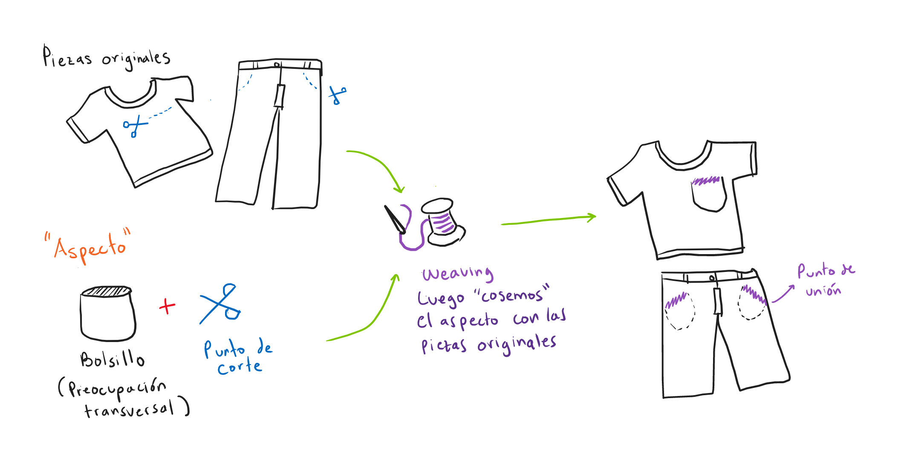

# spike-mn-aop
Spike para el uso de AOP en Micronaut para el manejo de logs transaccionales en funciones lambda.

## Contenido

- [Motivación](#motivación)
- [Mapeo del contexto en los logs](#mapeo-del-contexto-en-los-logs)
- [Introducción AOP](#introducción-AOP)
- [Recursos para el desarrollador](#recursos-para-el-desarrollador)
- [Conclusión](#conclusión)
- [Referencias](#referencias)

---
## Motivación

## Mapeo del contexto en los logs

En la función ```my-function-mdc``` existen dos implementaciones diferentes:

- La arquitectura de SLFJ la podemos observar a continuación:


_Tomado de: https://logback.qos.ch/manual/underTheHood.html_

En esta podemos observar las diferentes capas que tiene el componente SLFJ.

## Introducción AOP

La programación orientada a aspectos (AOP, por sus siglas en ingles) es un paradigma de programación
que busca incrementar la modularidad de las aplicaciones, permitiendo una clara separación de las preocupaciones
transversales (_cross-cutting concerns_) de la lógica de negocio principal.

### Aspecto

Un aspecto normalmente puede referirse a una capacidad que no está directamente relacionada
con la funcionalidad del sistema, pero tiene propiedades que impactan los atributos de calidad. 
En otras palabras, si en la programación orientada a objetos (OOP, por sus siglas en inglés) 
podemos definir la clase como unidad minima de modularidad, en AOP, esta unidad vendría siendo un _Aspecto_. 

### _Advice_

Se refiere al código adicional que resuelve la preocupación transversal. Representa el comportamiento adicional.

### _Join-point_

Se refiere a los puntos específicos del programa donde se va a "insertar" el _Advice_.

### _Point-cut_

Es el término dado a la especificación de los puntos de ejecución donde se inserta el _Advice_.
Detecta si un _join-point_ dado coincide con la especificación.

### _Weaving_

El lenguaje usado en este paradigma nos recuerda el mundo de la costura, por lo que 
podríamos hacer una analogía:



### AOP en Micronaut

Existen varias herramientas disponibles para realizar AOP con Java, entre las que se encuentran:
 - Aspectj
 - Spring AOP 
 - Micronaut AOP

Para este Spike, se decide explorar a profundidad Micronaut AOP, debido a que es el _framework_ elegido 
para desarrollar funciones lambdas. 

## Recursos para el desarrollador

Actualmente existen dos funciones:

- ```my-function-mdc```: En esta función se revisa el uso de MDC con SLFJ.
- ```my-function-aop```: En esta función se revisa como crear un aspecto para el registro de logs con Micronaut.

Cada una sirve de ejemplo para las tecnologías en cuestión.
El proyecto fue creado con el generador: [lambda-java-mn](https://github.com/alejandro56664-adl/spike-yeoman-aws-lambda)

### Build project

```bash
./gradlew clean build
```

### Run tests

```bash
./gradlew clean test
```

### Run my-function-mdc local with SAM

Handler: co.com.spike.lambda.demo.my.function.mdc.controller.LambdaController::execute

```bash
sam local invoke myfunctionmdc --event ./events/my-function-mdc-generic.json
```

### Run my-function-aop local with SAM

Handler: co.com.spike.lambda.demo.my.function.aop.controller.LambdaController::execute

```bash
sam local invoke myfunctionaop --event ./events/my-function-aop-generic.json
```

Links de interés sobre Micronaut:

- [User Guide](https://docs.micronaut.io/2.5.5/guide/index.html)
- [API Reference](https://docs.micronaut.io/2.5.5/api/index.html)
- [Configuration Reference](https://docs.micronaut.io/2.5.5/guide/configurationreference.html)
- [Micronaut Guides](https://guides.micronaut.io/index.html)
- [Micronaut AWS Lambda Function documentation](https://micronaut-projects.github.io/micronaut-aws/latest/guide/index.html#lambda)
- [AWS Lambda Handler](https://docs.aws.amazon.com/lambda/latest/dg/java-handler.html)
---

## Conclusión

## Referencias

- https://docs.micronaut.io/latest/guide/index.html#aop
- https://micronaut.io/2019/10/07/micronaut-aop-awesome-flexibility-without-the-complexity/
- https://hinchman-amanda.medium.com/introduction-to-java-aspect-oriented-programming-a9769613131e

- https://www.baeldung.com/mdc-in-log4j-2-logback
- https://dzone.com/articles/mdc-better-way-of-logging-1
- https://logback.qos.ch/manual/mdc.html
